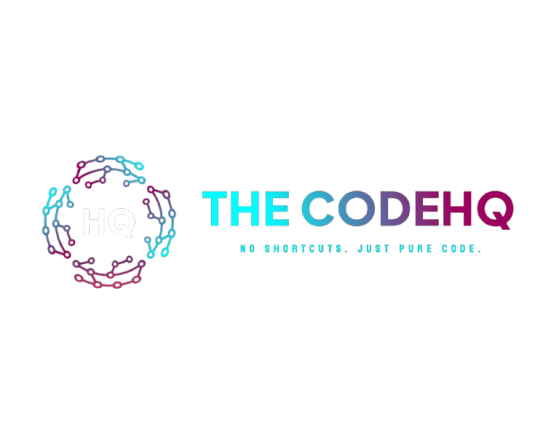

<!-- Visual Header / Brand Banner -->

  

  <b>Bespoke Web Systems • High-Throughput Architectures • Next-Gen Digital Products</b>
   
  <i>Engineered for enterprise speed, radical reliability, and uncompromised UX.</i>

[🌐 Visit Live Platform](https://www.thecodehq.com) • [⚡ Services](#-capabilities--solutions) • [🏛 Tech Ecosystem](#-technology-ecosystem) • [📫 Get In Touch](#-start-a-project)

---

## 📌 Executive Summary

**TheCodeHQ** is a modern software and digital solutions agency engineered to build production-grade web systems. We discard cookie-cutter templates and sluggish wrappers in favor of hand-tuned code, robust data models, and fluid user experiences. 

> **🔒 Proprietary Notice:** The core codebase for `thecodehq.com` and our private client applications are maintained in secure, restricted repositories. This public index serves as our architectural overview, verified technology stack, and public demonstration portal.

---

## ⚡ Capabilities & Solutions

<table>
  <tr>
    <td width="50%" valign="top">
      <h3>💻 Full-Stack Web Development</h3>
      <ul>
        <li>Ultra-responsive Single-Page (SPA) & Multi-Page Applications.</li>
        <li>Server-Side Rendered (SSR) & Static Edge architectures for instant load times.</li>
        <li>Custom component design systems with pixel-perfect responsive layouts.</li>
      </ul>
    </td>
    <td width="50%" valign="top">
      <h3>⚙️ Back-End & API Engineering</h3>
      <ul>
        <li>High-concurrency RESTful APIs and microservice patterns.</li>
        <li>JWT-based session authentication and role-based access control (RBAC).</li>
        <li>Secure payment gateway pipelines and external webhook integrations.</li>
      </ul>
    </td>
  </tr>
  <tr>
    <td width="50%" valign="top">
      <h3>🗄️ Database Architecture & Scaling</h3>
      <ul>
        <li>Schema modeling for high-scale NoSQL (MongoDB) and Relational (PostgreSQL) databases.</li>
        <li>Data aggregation, caching strategies, and indexing for low-latency queries.</li>
        <li>Automated failover, continuous backups, and rigorous data sanitization.</li>
      </ul>
    </td>
    <td width="50%" valign="top">
      <h3>🚀 Performance & DevOps Infrastructure</h3>
      <ul>
        <li>Sub-second Time-to-First-Byte (TTFB) and 95+ Core Web Vital scores.</li>
        <li>Zero-downtime CI/CD deployment pipelines via GitHub Actions and Edge CDNs.</li>
        <li>Strict security hardening against common vulnerabilities (XSS, CSRF, Injection).</li>
      </ul>
    </td>
  </tr>
</table>

---

## 🏛 Technology Ecosystem

We leverage an industry-standard stack optimized for developer velocity and computational efficiency:

| Layer | Technologies |
| :--- | :--- |
| **Front-End Architecture** |      |
| **Back-End Engineering** |    |
| **Database & Caching** |   |
| **DevOps & Delivery** |    |

---

## 🚀 Live Product Case Study

### 🌐 [TheCodeHQ Official Agency Portal](https://www.thecodehq.com)

Our digital flagship acts as an interactive touchpoint for clients requiring modern software engineering.

* **Deployment:** Global Edge Network on Vercel
* **Key Milestones:**
  * Handcrafted dynamic UI with zero layout shifts (CLS < 0.01).
  * Asset delivery pipeline reducing total page payloads under 500KB.
  * Direct asynchronous lead qualification and client submission engine.

---

## 📬 Start a Project

We collaborate with founders, growing companies, and organizations looking to bring enterprise-level technical standards to their web applications.

- **Official Web Portal:** [www.thecodehq.com](https://www.thecodehq.com)
- **Consultation & Direct Booking:** Available via the portal contact channels

 

  <b>TheCodeHQ</b> • No Shortcuts. Just Pure Code. 
  © 2026 TheCodeHQ. All rights reserved.

